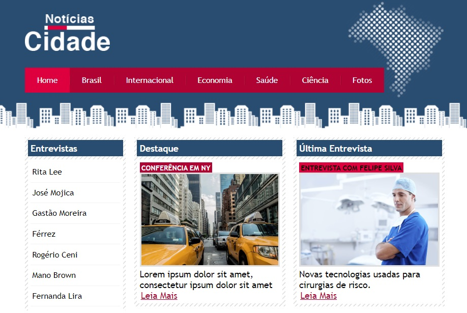

# News Portal (Notícias Cidade)

Welcome! 

This repository contains my solution for News Portal created using some intermediate and advanced concepts in HTML5 and CSS3.

This project was developed during the [Complete Web Development](https://www.udemy.com/course/web-completo/) course (Section CSS3 Intermediate and Advanced) held at UDEMY.



# 🧠 About

The goal with this project is implement an static page using HMTL and CSS to learn and practice about this functionalities below:

- [x] CSS selectors
- [x] Inheritance
- [x] Navigation bar
- [x] Layouts
- [x] Tables
- [x] Styling Forms
- [x] Styling Lists
- [x] And much more

## 🖥️ Installation

1. Clone this repo
```bash
git clone https://github.com/robernar2011/NewsPortal.git
```
